## Callbacks

Can be extremely confusing when you first start off, as they can be used for synchronous and asynchronous operations.

When used synchronously, the callback is ultimately part of the JS single thread of execution `(TOE)`, in fact we don't step out of it.

When used asynchronously, we in effect step out of the JS thread of execution, this is done by means of invoking a node API, which outside of the JS single thread goes and does its thing, then via the event loop is brought back to the JS single thread of execution.

Execution context = doing the code line by line. globally or in a function, this is known as thread of execution. We are threading down executing each line and then the memory where you store stuff. Together these are known as `execution context`.
And the `CallStack` tracks those execution contexts.

A callback is just a function that is invoked at a later stage wether by the HOF that takes it in or via the event loop if asynchronous.

Definition required for later:-
Hoisting = variables and functions are hoisted to the top of the scope that they are declared in, whether that be the global scope or a function scope or a block scope depending upon the keyword used to define them.

#### Remember what do we mean by async operations
If we need the result of an operations such as getting a file etc, the operation will take sometime. We can either wait, ie handle the operations synchronously, this will however block our single threaded code from doing anything else while the operation to complete.  
### Or  
We somehow invoke an operation away from our single, it does its thing and gets a result, in the meantime our JS single thread continues with its code, then at a later stage we bring back the result and use it.  

Callbacks key features:-
- It's used for results of synchronous/asynchronous operations 
- It's a function
- It is passed into another function as an argument
- The callback should contain some error checking within it, and if necessary be able to generate an error object  
&nbsp;

### Example 1 - Used for asynchronous operation
   
&nbsp;

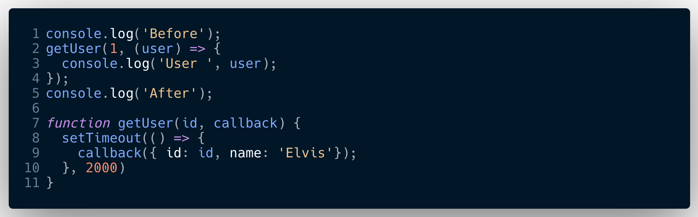

If we removed all the chatter what is the above about really:-

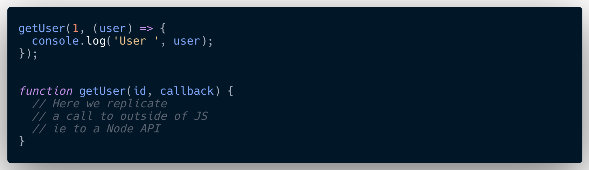

So really all we have is a function called getUser thats takes in another function as a parameter and the function we pass in does a call to a Node API basically we want to invoke an async operation.

But something that shouldn't be overlooked is that getUser is a higher order function (ie it takes in another function as a parameter, note a function that also returns a function is also classed as HOF ).

IMPORTANT:- where you define your functions (ie where you write them, not invoke them!!!), determines what variables your function has access to when, you invoke it.

On line 2 we define the anonymous function, which is within the getUser function call. thus based on above our anonymous function will have access to the local memory of getUser ie its parameters & variables. thus is achieved through the concept of `closures`.

How to identify what is going on:-  

1. Line 2 is a function, how do we know?
   - it takes in arguments
   - if we however over it with cursor, VScode will tell us it is
   - if we look up its name, on line 7 it tells us it is  
2. Into the getUser function, the final argument we pass in is a function
   - function are first class objects (they have all the features of an object)
   - getUser takes in a function thus it's a HOF (higher order function)
3. HOF also follow DRY, ie we could pass in any function as the argument to getUser.
   -  provided its 

&nbsp;

### Frame 1
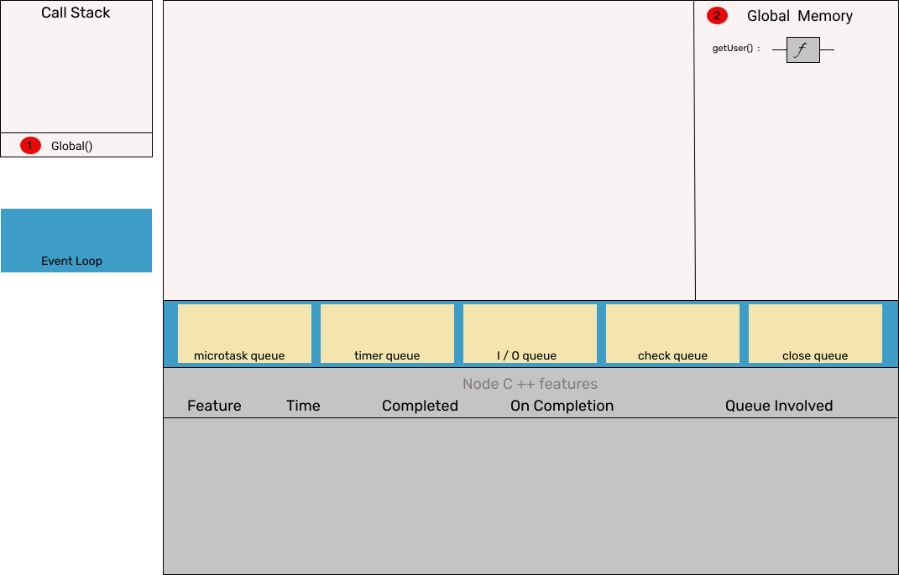

1. The global execution context (GEC) is created by default, and is put on the base of the `Call Stack`.

2. Now because `global` is top of the Call Stack a global execution context is created, which consists of two areas, one being the JS thread of execution area and the other being the memory associated with the execution context (the actual name is variable environment. but memory is more descriptive).
   Into global memory is hoisted the variables and their values, example the variable `getUser` is loaded and its value is a function, so all the function code is loaded in.

&nbsp;

### Frame 2
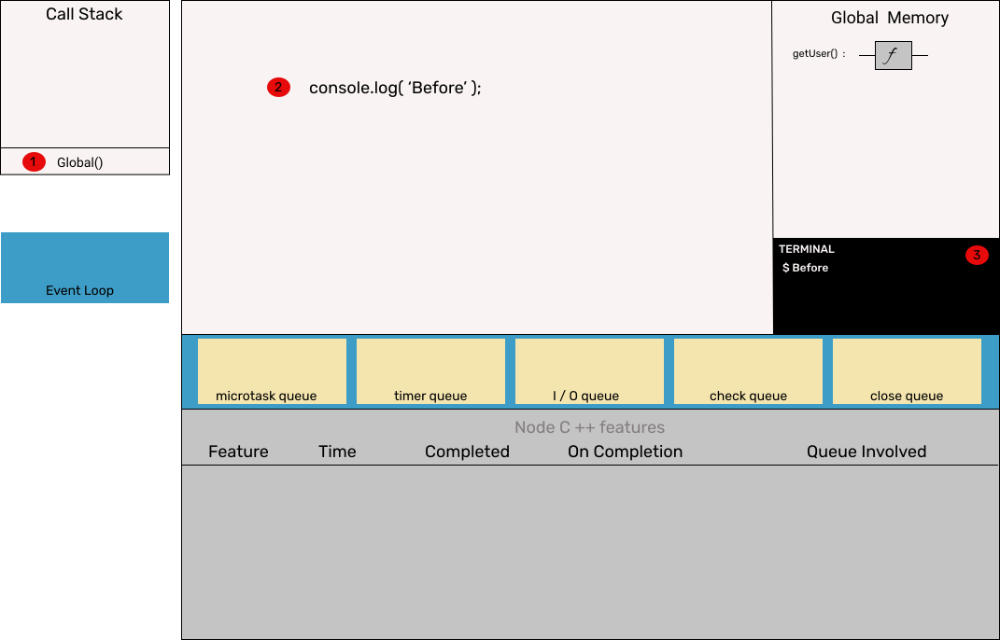

blah blah blah

&nbsp;

### Frame 3
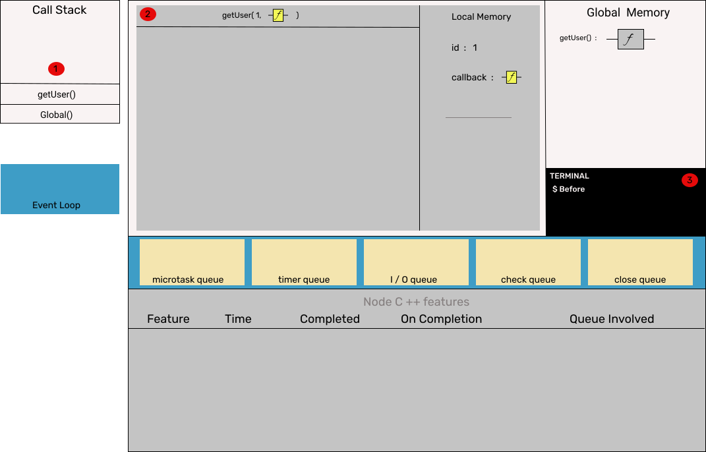

blah blah

&nbsp;
real life example of map function behind the scenes
 
### Example 2 - Used for synchronous operation

Remember in this script everything is done within the JS environment running in Node, that is to say we are not stepping out of it and using any Node APIs thus no engagement of the `Callback queue` or the `Event loop`.

We have a simple function which 

reminder: 
1. - JS is single threaded - it runs one command at a time
2. - JS is synchronously executed - each line is run in order it appears, and each line must be completed before moving on.

Aside - the event loop is in charge of determining what function is next allowed on the call stack and thus will be ran.

Call Stack - how JS keeps track of what function is currently being ran, ie its the one that is top of the Call Stack. The Call Stack is simply a stack (record) of calls to functions (that are still open), recorded in a LIFO structure.

&nbsp;

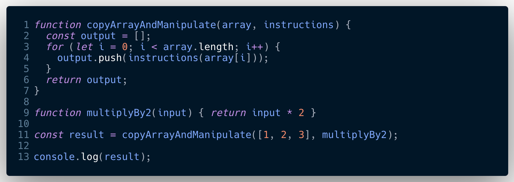

So walking through the code in detail:-

### Frame 1
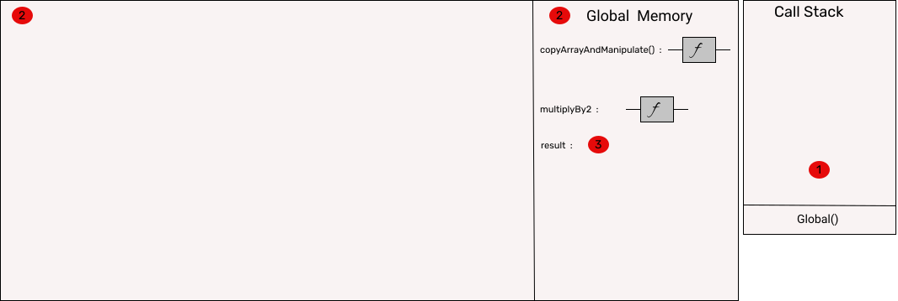

1. The global execution context (GEC) is created by default, and is put on the base of the `Call Stack`.

Global just means its not inside of a function.

2. Now because `global` is top of the Call Stack a global execution context is created, which consists of two areas, one being the JS thread of execution area and the other being the memory associated with the execution context (the actual name is variable environment. but memory is more descriptive).
   Into global memory is hoisted the variables and their values, example the variable `multiplyBy2` is loaded and its value is a function, so all the function code is loaded in.

3. The variable `result` is declared, but at this stage it has not been assigned a value so its `uninitialised` as we are using `const` to declare it.

So in summary:-
The variable on line 11 and the functions on lines 1 & 9 are hoisted into the `global memory`.
awaiting the JS thread of execution to start.

### Frame 2
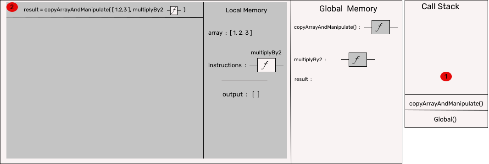

Now the JS parser starts going through the code from top to bottom, on line 11 it comes across a call to execute the `copyArrayAndManipulate` function, so the following occurs:-

1. The `copyArrayAndManipulate()` function is placed on the `Call Stack`. 

2. This then creates an execution context and populates its corresponding local memory with:-
   the parameter `array`, whose value is the first argument passed in, an array of three integers.
   the parameter `instructions`, whose value is second argument passed in, a function (multiplyBy2 function).
   the variable `output` is hoisted in which is a blank array, which is derived from within the function block.

Every time a function is executed an execution context for that function is created (FEC), which basically means it creates a local execution context and local memory allocation to store variables, parameters and function declarations.

### Frame 3-0
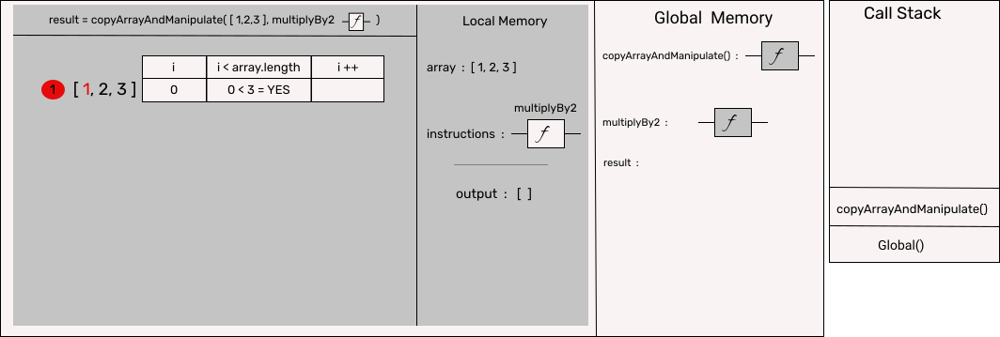

1. - The `TOE` hits line 3 the `for statement`, and sets up a loop with three expressions (initial, conditional & increment).
   the `initial expression`  is set to 0 and the `conditional expression` is true so we can move onto the next stage.

### Frame 3-1
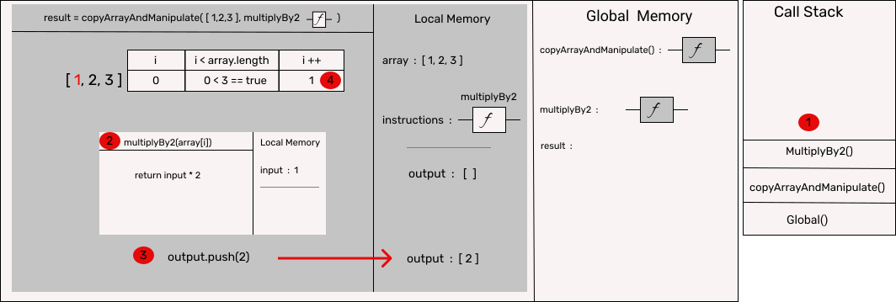

Now we enter the code block of the `for statement`.
1. - on line 4 we have an object, method & function combination. We invoke the `multiplyBy2` function, thus its placed on top of the call stack.
2. - We now create a local execution context for the function which is on top of the call stack. Into its memory is loaded the parameter `input` with its value of `1` coming from the passed in argument. In the execution context the `TOE`, per line 9 multiplies the `input` which is 1 by 2 and returns out `2` ie the value of `input`. 
   Now the multiplyBy2 function has completed and will be removed (popped) off the call stack.
3. - The object, method combo now kicks in, onto the end of our blank `output` array we insert the returned value of `2` from above.
4. - The `increment expression` now increases `i` to `1`.

### Frame 3-2
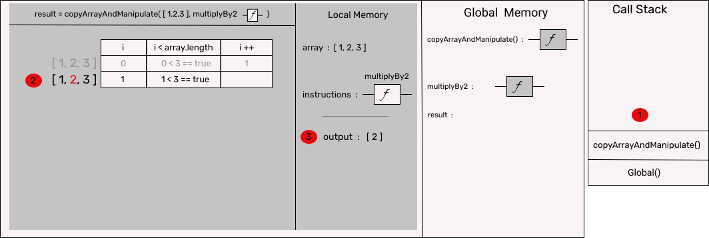

1. - As can be seen we are back in the `copyArrayAndManipulate` function.
2. - The `conditional expression` is true, ie 1 is less than 3.
3. - Also note that the variable `output` now has a populated array containing the integer 2.

### Frame 3-3
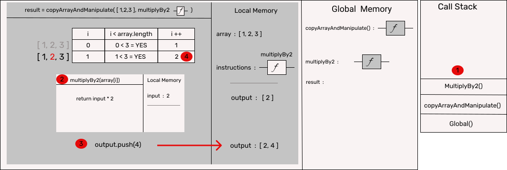

1. - on line 4 we have an object, method & function combination. We invoke the `multiplyBy2` function, thus its placed on top of the call stack.
2. - We now create a local execution context for the function which is on top of the call stack. Into its memory is loaded the `input` variable we passed in, with its value of `2`. In the execution context the `TOE`, per line 9 multiplies the `input` which is 2 by 2 and returns out `4` ie the value of `input`. 
   Now the multiplyBy2 function has completed and will be removed (popped) off the call stack.
3. - The object, method combo now kicks in, onto the end of our blank `output` array we insert the returned value of `4` from above.
4. - The `increment expression` now increases `i` to `2`.

### Frame 3-4
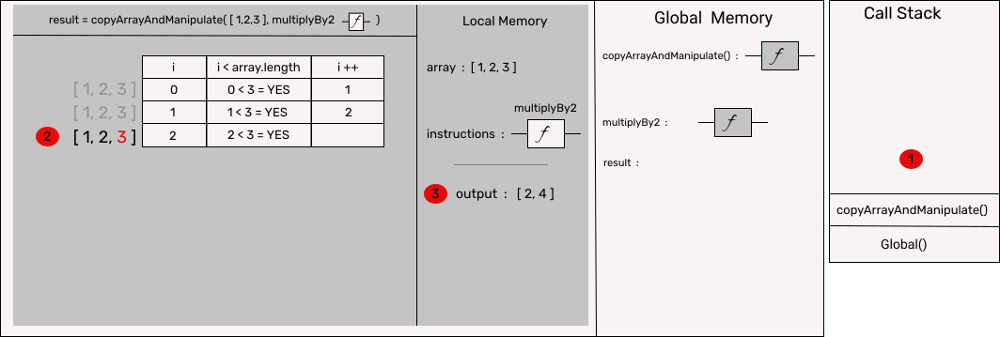

1. - As can be seen we are back in the `copyArrayAndManipulate` function.
2. - The `conditional expression` is true, ie 2 is less than 3.
3. - Also note that the variable `output` now has a populated array containing the integers 2 & 4.

### Frame 3-5
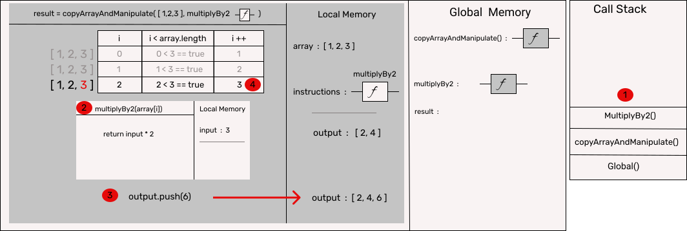

1. - on line 4 we have an object, method & function combination. We invoke the `multiplyBy2` function, thus its placed on top of the call stack.
2. - We now create a local execution context for the function which is on top of the call stack. Into its memory is loaded the `input` variable we passed in, with its value of `3`. In the execution context the `TOE`, per line 9 multiplies the `input` which is 3 by 2 and returns out `6` ie the value of `input`. 
   Now the multiplyBy2 function has completed and will be removed (popped) off the call stack.
3. - The object, method combo now kicks in, onto the end of our blank `output` array we insert the returned value of `6` from above.
4. - The `increment expression` now increases `i` to `3`.

### Frame 3-6
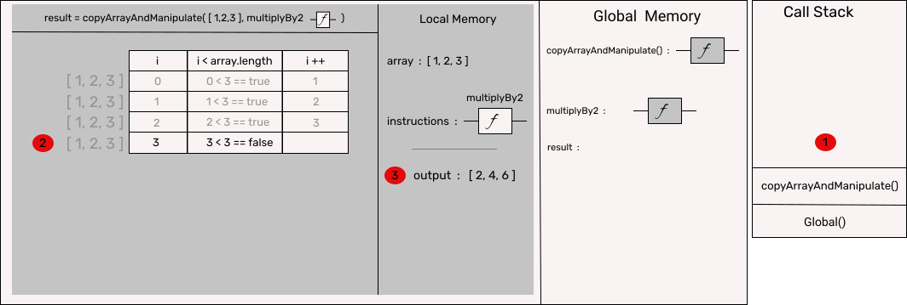

1. - As can be seen we are back in the `copyArrayAndManipulate` function.
2. - The `conditional expression` is false, ie 3 is not less than 3.
3. - Also note that the variable `output` now has a populated array containing the integers 2, 4 & 6.

As the `for loops` conditional expression has not be met we exit out of it.

### Frame 4
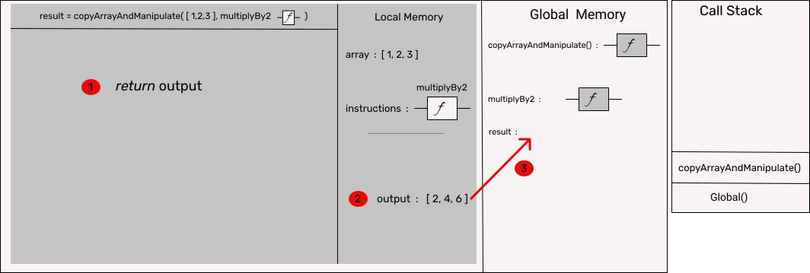

1. - We now hit line 6 which is the `return statement` for the copyArrayAndManipulate function. 

2. - the variable `output` is stored in the execution context's local memory.

3. - We pop the `copyArrayAndManipulate` function off the call stack, we return `[ 2, 4, 6 ]` ie the value of output and this becomes the value of the global variable `result`.

### Frame 5
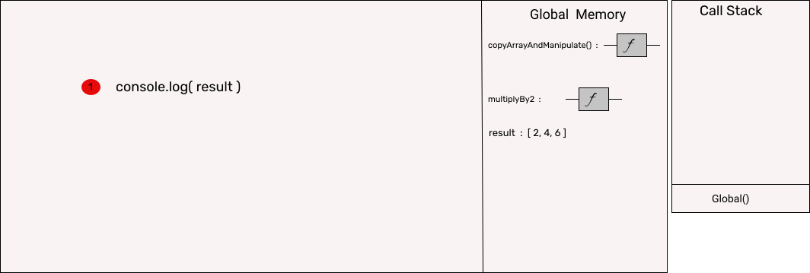

1. the `TOE` now hits line 13 and return to the console the value of the variable `result` which is the array `[2, 4, 6]`

There is no further code to execute so the script ends and global is popped off the call stack. 

