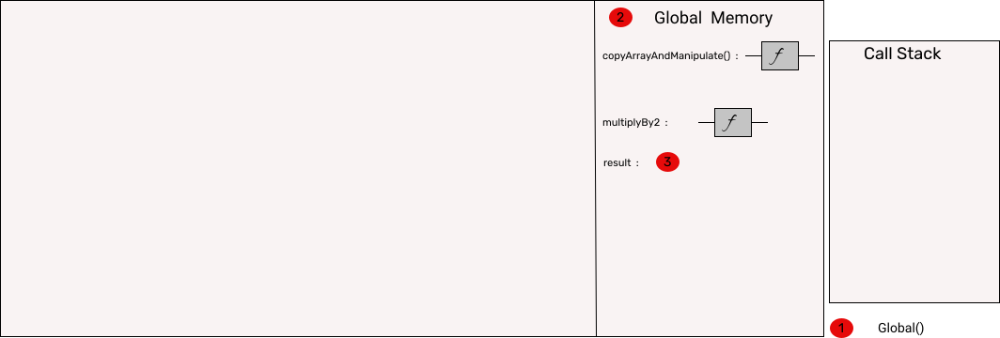
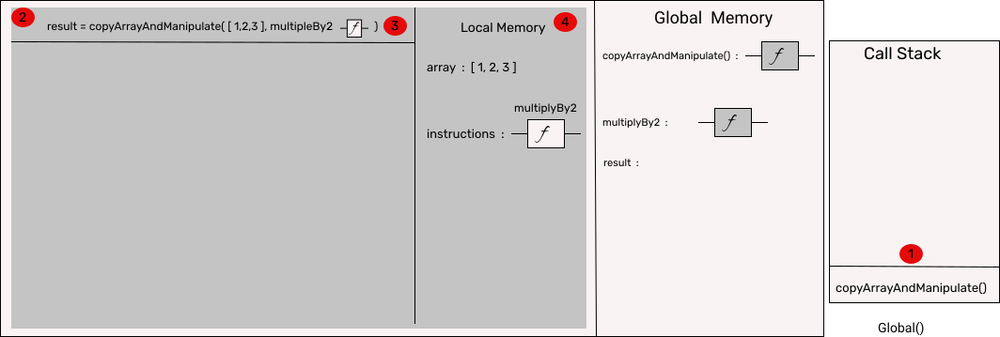
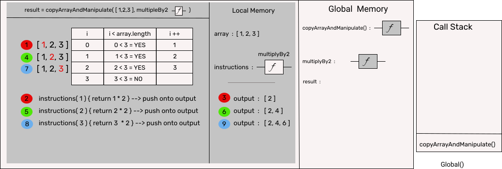
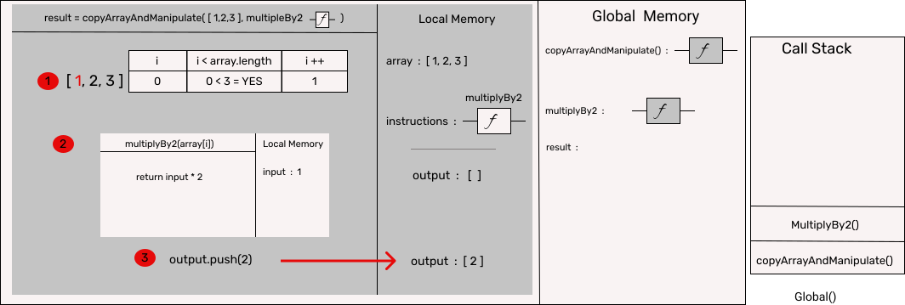
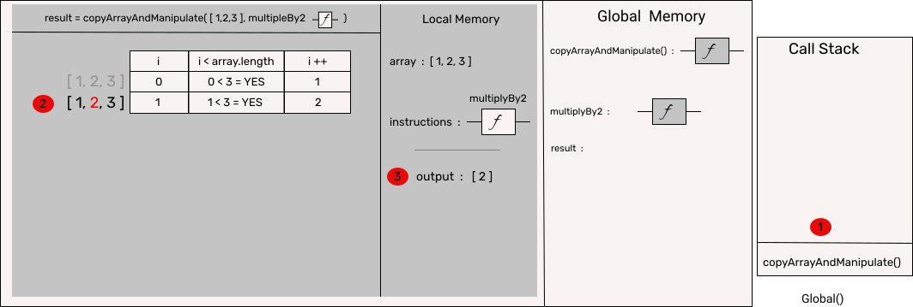
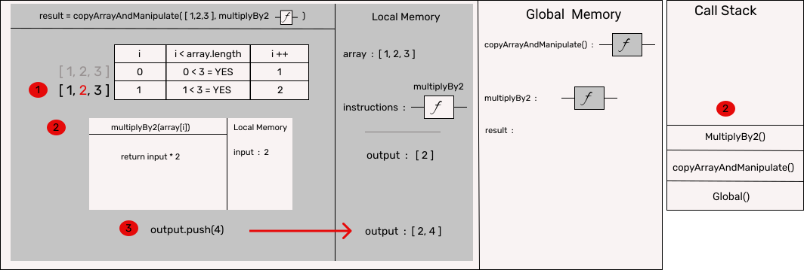
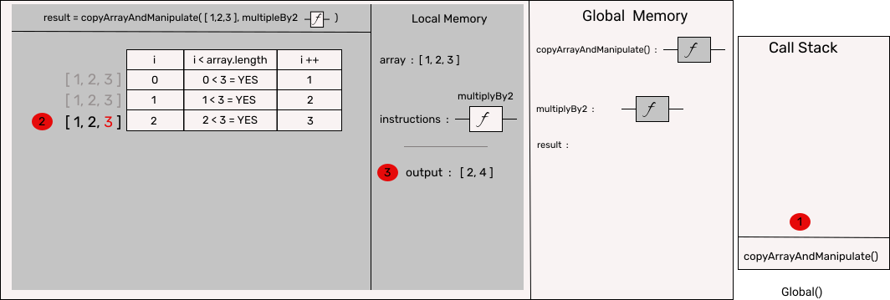
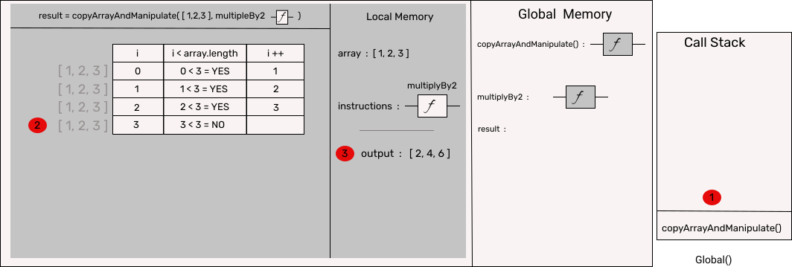
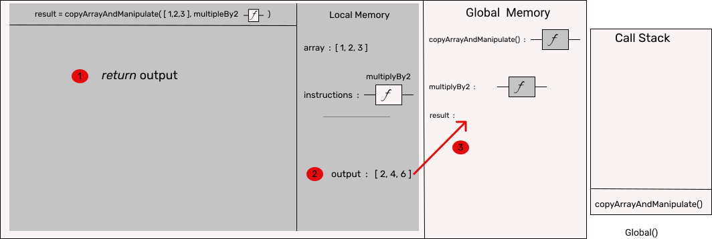
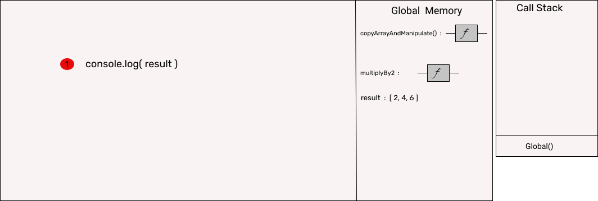

## Callbacks

Can be extremely confusing when you first start off, as they can be used for synchronous and asynchronous operations.

When used synchronously, the callback is ultimately part of the JS single thread of execution, in fact we don't step out of it.

When used asynchronously, we in effect step out of the JS thread of execution, this is done by means of invoking a node API, which outside of the JS single thread goes and does its thing, then via the event loop is brought back to the JS single thread of execution.

Infact until the advent of promises they where the only way to handle asychronous operations.

#### Remember what do we mean by async operations
The whole purpose it that need the result of an operations such as getting a file etc, the operation will take sometime. We can either wait, ie handle the operations synchronously, this will however block our single threaded code from doing anything else while the operation to complete.  
Or  
We let the operation go off (away from our single thread) do its thing and get the result, in the meantime the our single thread continues with the other code, then at a later stage we bring back the result and use it.  

Callbacks key fetures:-
- Its used for results of asynchronous operations 
- A callback is a function
- It is passed into another function as an argument
- The callback should contain some error checking within it, and if necessary be able to generate an error object  
&nbsp;

### Example 1 - Used for asynchronous operation
   
&nbsp;

How to identify what is going on:-  

1. Line 2 is a function, how do we know?
   - it takes in arguments
   - if we howver over it with cursor, VScode will tell us it is
   - if we look up its name, on line 7 it tells us it is  
2. Into the getUser function, the final argument we pass in is a function
   - function are first class objects (they have all the features of an object)
   - getUser takes in a function thus it's a HOF (higher order function)
3. HOF also follow DRY, ie we could pass in any function as the argument to getUser.
   -  provided its 

&nbsp;
real life example of map function behind the scenes

### Example 2 - Used for synchronous operation

Remember in this script everything is done within the JS environment running in Node, that is to say we are not stepping out of it and using any Node API's thus no engagement of the `Callback queue` or the `Event loop`.

We have a simple function which 

reminder: 
1. - JS is single threaded - it runs one command at a time
2. - JS is synchronously executed - each line is run in order it appears, and each line must be completed before moving on.

Aside - the event loop is in charge of determining what function is next allowed on the call stack and thus will be ran.

Call Stack - how JS keeps track of what function is currently being ran, ie its the one that is top of the Call Stack.

&nbsp;

So walking through what happens:-

### Frame1

1. The global execution context (GEC) is created by default, and is put on the base of the `Call Stack`.

2. The JS parses xxxxxxxxx

3. The variable `result` is declared, but at this stage it has not been assigned a value so its unitialised.

### Frame2

Now the JS parser starts going through the code line by line.

1. Onto the `Call Stack` is placed the `copyArrayAndManipulate()` function. 

2. This creates an execution context, which our JS single thread of excution now steps into.

Everytime a function is executed an execution context for that function is created (FEC), which basically means it creates a local execution context and local memory allocation to store variables, parameters and function declarations.

3. The function has two arguments an array & multiplyBy2  
   .1 - the array is `[ 1, 2, 3 ]`
   .2 - multiplyBy2 is a function, so the whole `function` is passed in.

4. So in the local memory of the execution context we xx

### Frame3

this is a challenge  

### Frame3-0

this is a challenge

### Frame3-1

this is a challenge

### Frame3-2

this is a challenge

### Frame3-3

this is a challenge

### Frame3-4

this is a challenge

### Frame3-5

this is a challenge

### Frame4

this is a challenge  

### Frame5

this is a challenge  
