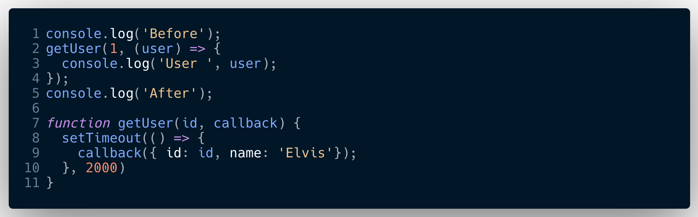

## Callbacks

Can be extremely confusing when you first start off, as they can be used for asynchronous and synchronous operations. Infact until the advent of promises they where the only way to handle asychronous operations.

So nowadays we told only to see them used for synchronous operations.

#### Remember what do we mean by async operations
The whole purpose it that need the result of an operations such as getting a file etc, the operation will take sometime. We can either wait, ie handle the operations synchronously, this will however block our single threaded code from doing anything else while the operation to complete.  
Or  
We let the operation go off (away from our single thread) do its thing and get the result, in the meantime the our single thread continues with the other code, then at a later stage we bring back the result and use it.  

Callbacks key fetures:-
- Its used for results of asynchronous operations 
- A callback is a function
- It is passed into another function as an argument
- The callback should contain some error checking within it, and if necessary be able to generate an error object  
&nbsp;

### Example 1 - Used for asynchronous operation
   
&nbsp;

How to identify what is going on:-  

1. Line 2 is a function, how do we know?
   - it takes in arguments
   - if we howver over it with cursor, VScode will tell us it is
   - if we look up its name, on line 7 it tells us it is  
2. Into the getUser function, the final argument we pass in is a function
   - function are first class objects (they have all the features of an object)
   - getUser takes in a function thus it's a HOF (higher order function)
3. HOF also follow DRY, ie we could pass in any function as the argument to getUser.
   -  provided its 

&nbsp;
real life example of map function behind the scenes

### Example 2 - Used for synchronous operation

We have a simple function which 

&nbsp;

So walking through what happens:-

