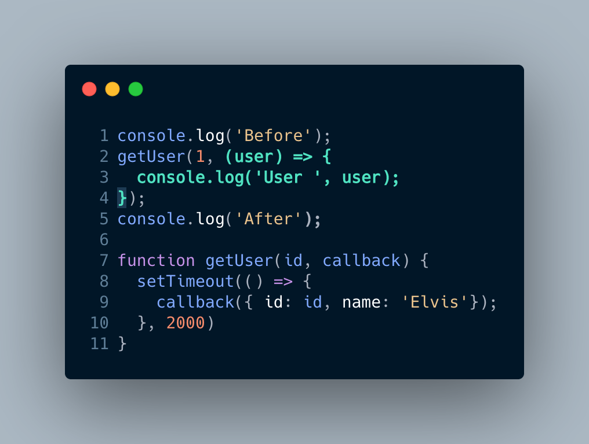
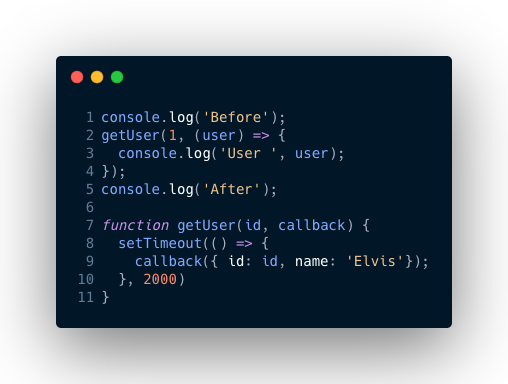
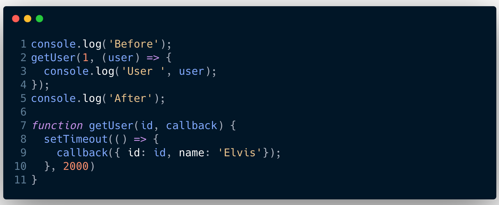

## Callbacks

Its used for results of asynchronous operations 
A callback is a function
It is passed into another function as an argument
The callback should contain some error checking within it, and if necessary be able to generate an error object


#### Callbacks in detail

```js
console.log('Before');
getUser(1, (user) => {
  console.log('User ', user);
});
console.log('After');

function getUser(id, callback) {
  setTimeout(() => {
    callback({ id: id, name: 'Elvis'});
  }, 2000)
}
```





