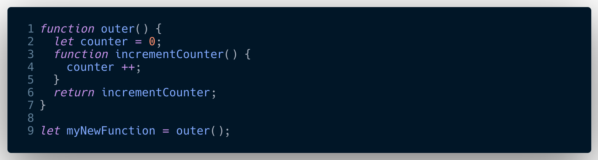

## Closures

When a function is defined, it gets a hidden property called `[[ scope ]]` that references  `local Memory` (ie variable environment - proper name) in which it, the function has been defined.

So basically when a function is defined inside another function the inner function via `[[scope]]` gets access to the outer functions `local Memory` in regards of any variables its going to need.

So using below we can see this in action:-

Lexical scope

The Function is popped off the call stack and prior to the local Memory data being garbage collected,JS goes 'oh no' another function needs access to this data, so I need to store it in the backpack, but only data that is referenced, anything that is not later required is garbage collected.

