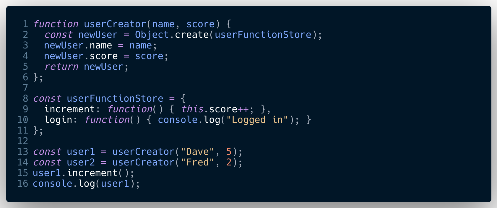

## __proto__

The double underscore proto property, or dunda proto dunda property as its known is not to be confused with the protoype property.
It's easy to do as the JS gods have not been kind to us on the naming convention front.

Taking a step back, we create functions for tasks that we want to repeat, so if we wanted to create a number of objects we could manually create then, assigning properties and methods to each one. Say we had an application with 5,000 users, not only would this be a long laborious task, if each user where to have functionality then we would have wasted memory due to duplicated methods.

So the solution is to have a constructor function, which we can use to create our objects but also link back to for methods.
Thus not only removing method duplication but also giving us better control over functions as only one location to update if necessary.

Object.create // way to create an object that has a bond (aka link).
the argument that Object.create excepts is always what will be stored in the proto property.
-- creates a blank object
-- the blank object has a hidden property called dunda proto dunda (just called proto from now on) who's value is the link to the object whose methods/properties we want to access.
-- the proto property is hidden, but not completely in that we can see it in the chrome dev tools.

note we also have an implicit (ie automatically filled in for us) parameter called `this`.

JavaScript has its prototypal feature 

Object have a connection to other objects through their proto property

